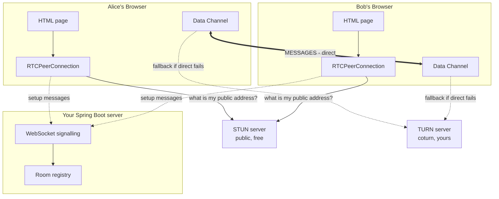
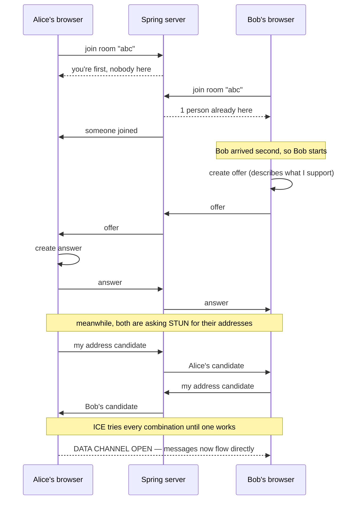

# Design Doc: Peer-to-Peer Chat App

**Stack:** plain HTML + a little TypeScript/JavaScript, Spring Boot backend.
**Assumes:** you have never built a decentralised system. Every component is explained from zero.

---

## 1. What we are building

A chat app where **messages travel directly from one person's browser to the other's**. Your server never sees the message content.

Start with **text chat**. Video is a small addition later, and — this is the useful part — **the server code is identical either way.** Your server never learns what the two browsers decided to send each other.

---

## 2. The one idea that makes this "P2P"

**A normal chat app:**

```
Alice's browser  →  YOUR SERVER  →  Bob's browser
```

Every message passes through you. You store it, you can read it, you pay for the bandwidth.

**A P2P chat app:**

```
Alice's browser  ←────────────────→  Bob's browser
                       ↑
              YOUR SERVER (introductions only)
```

Your server helps them find each other. Then it steps out of the way and the messages flow directly.

**Consequences, good and bad:**

| | |
|---|---|
| Bandwidth cost | Near zero — messages don't touch you |
| Privacy | Genuinely end-to-end encrypted; you *cannot* read messages |
| History | You have none. If both peers are offline, the message doesn't exist |
| Moderation | Impossible. You can't see the content |
| Offline delivery | Doesn't work. Both must be online simultaneously |

That last one is important and surprising: **pure P2P chat has no offline messaging.** There's nowhere to store a message for someone who isn't there. Real products like WhatsApp are *not* P2P for this reason — they're centralised with end-to-end encryption, which is a different thing.

---

## 3. Why this is harder than it sounds

Here's the problem that all the complexity exists to solve.

Alice's laptop is behind her home router. Bob's is behind his. Neither has a public address on the internet. Neither can accept an incoming connection — their routers reject unsolicited traffic.

**Two ordinary computers on the internet cannot connect to each other directly by default.** This is not a bug; it's how home networking works (it's called NAT — Network Address Translation).

So the real question isn't "how do I send a message." It's:

1. How does Alice find out Bob exists?
2. How does Alice find out where Bob is?
3. How do they establish a connection when neither can accept one?

Everything below is the answer to those three questions.

---

## 4. Architecture

### The whole system



**Read the arrows carefully.** The dotted lines to your server are *setup only*. The thick line between the two data channels is where messages actually flow, and it doesn't touch your server at all.

---

## 5. Every component, explained

### Browser side

#### 5.1 The HTML page

Just a text box, a send button, and a message list. No framework needed — a single `.html` file with a `<script>` tag is genuinely enough.

**Its job:** collect what the user types, display what arrives.

#### 5.2 The signalling client (WebSocket)

A normal WebSocket connection to your Spring server.

**Its job:** carry *setup* messages between the two browsers before they can talk directly.

**Why it exists:** Alice needs to send Bob some technical information ("here's how to reach me"), but she can't reach Bob yet — that's the whole problem. So the information goes through your server. It's a chaperone at a party introducing two people who don't know each other.

Once the introduction succeeds, the chaperone isn't needed.

#### 5.3 `RTCPeerConnection`

The browser object that does all the hard work. Built into every browser — you don't install anything.

**Its job:** find a network path to the other browser and maintain an encrypted connection over it.

Inside, it runs a process called **ICE**, which:
- collects every address you might be reachable at
- swaps that list with the other peer (via your signalling server)
- tries every combination until one works

You never write that logic. You create the object, hand it your STUN/TURN details, and listen for events.

#### 5.4 `RTCDataChannel`

A pipe for arbitrary data riding on top of the peer connection.

**Its job:** actually send your chat messages.

Once open, it's simple:

```javascript
channel.send("hello");                        // send
channel.onmessage = (e) => display(e.data);   // receive
```

That's the whole chat protocol. **Everything else in this document exists to get to the point where those two lines work.**

Nice detail: you can configure it to behave like TCP (reliable, ordered — right for chat) or like UDP (fast, lossy — right for game state). Chat wants the default: reliable and ordered.

### Server side — Spring Boot

#### 5.5 The signalling endpoint

A WebSocket endpoint, roughly 100 lines.

**Its job:** relay messages between the two browsers in a room.

**The key thing to understand: this server does not understand WebRTC.** It receives a blob of JSON and forwards it to the other person in the room. It never parses it, never inspects it, never stores it. It's a dumb pipe with a room lookup.

This is genuinely why WebRTC didn't standardise signalling — there's nothing to standardise. It's "forward this to that person."

#### 5.6 The room registry

An in-memory map: room name → the sessions currently in it.

**Its job:** know who to forward a message to.

A `ConcurrentHashMap` is entirely sufficient. You only need Redis when you run more than one server instance, which is not now.

### External services

#### 5.7 STUN server

**The problem it solves:** your computer does not know its own public address. It knows it's `192.168.1.14` on your home network — an address that means nothing on the internet.

**Its job:** you send it a packet, it replies "the address I saw this come from is 203.0.113.7, port 54321." Now you know what to tell the other peer.

**What you do:** nothing. Use Google's free public one — `stun:stun.l.google.com:19302`. It's a single line of config and it handles enormous load because each request is tiny and stateless.

#### 5.8 TURN server

**The problem it solves:** sometimes the direct connection cannot be established at all. Certain router types (symmetric NAT) and strict corporate firewalls block it no matter what.

**Its job:** relay traffic between the two peers when direct fails. Alice sends to TURN, TURN forwards to Bob.

**The honest trade-off:** when TURN is in use, **you are no longer peer-to-peer** — it's a relay in the middle. It's the fallback that stops your app from simply failing for some users.

**What you do:** run **coturn** (open source). Roughly 10–20% of real connections need it, and you pay for that bandwidth. **For local development you can skip it entirely.**

---

## 6. How a connection is established

The core flow. It looks like a lot, but it's four kinds of message.



### The four message types

| Message | Meaning |
|---|---|
| **join** | "I'm entering this room" |
| **offer** | "Here's what I support and how to reach me" (technical description called SDP) |
| **answer** | "Here's my matching description" |
| **candidate** | "Here's one address you might reach me at" — sent many times as ICE discovers more |

**Offer and answer** are one exchange. **Candidates** trickle continuously — that's normal, and you'll see a dozen of them.

Your server treats all four identically: look up the other person, forward.

---

## 7. The Spring signalling server

This is the complete server. It's genuinely this small.

```java
@Configuration
@EnableWebSocket
public class SignalingConfig implements WebSocketConfigurer {

    private final SignalingHandler handler;

    public SignalingConfig(SignalingHandler handler) {
        this.handler = handler;
    }

    @Override
    public void registerWebSocketHandlers(WebSocketHandlerRegistry registry) {
        registry.addHandler(handler, "/signal").setAllowedOrigins("*");
    }
}
```

```java
@Component
public class SignalingHandler extends TextWebSocketHandler {

    // room name -> sessions currently in that room
    private final Map<String, Set<WebSocketSession>> rooms = new ConcurrentHashMap<>();
    private final ObjectMapper mapper = new ObjectMapper();

    @Override
    protected void handleTextMessage(WebSocketSession session, TextMessage message)
            throws Exception {

        JsonNode msg = mapper.readTree(message.getPayload());

        if ("join".equals(msg.get("type").asText())) {
            String room = msg.get("room").asText();
            session.getAttributes().put("room", room);

            Set<WebSocketSession> peers =
                rooms.computeIfAbsent(room, k -> ConcurrentHashMap.newKeySet());

            // tell the joiner how many were already here — this decides who offers
            send(session, Map.of("type", "joined", "peers", peers.size()));

            // tell everyone else that someone arrived
            for (WebSocketSession other : peers) {
                send(other, Map.of("type", "peer-joined"));
            }
            peers.add(session);
            return;
        }

        // everything else: forward verbatim to the other people in the room.
        // We do NOT look inside. Offer, answer, candidate — all the same to us.
        String room = (String) session.getAttributes().get("room");
        for (WebSocketSession other : rooms.getOrDefault(room, Set.of())) {
            if (!other.getId().equals(session.getId()) && other.isOpen()) {
                other.sendMessage(new TextMessage(message.getPayload()));
            }
        }
    }

    @Override
    public void afterConnectionClosed(WebSocketSession session, CloseStatus status)
            throws Exception {
        String room = (String) session.getAttributes().get("room");
        if (room == null) return;

        Set<WebSocketSession> peers = rooms.getOrDefault(room, Set.of());
        peers.remove(session);
        for (WebSocketSession other : peers) {
            send(other, Map.of("type", "peer-left"));
        }
        if (peers.isEmpty()) rooms.remove(room);
    }

    private void send(WebSocketSession s, Object payload) throws IOException {
        if (s.isOpen()) {
            s.sendMessage(new TextMessage(mapper.writeValueAsString(payload)));
        }
    }
}
```

Dependency:

```xml
<dependency>
    <groupId>org.springframework.boot</groupId>
    <artifactId>spring-boot-starter-websocket</artifactId>
</dependency>
```

> **A concurrency note relevant to you:** `WebSocketSession.sendMessage` is **not thread-safe**. With several peers signalling at once, two threads can interleave writes and corrupt a frame — the same class of race as the counter in your concurrency lab, in production form. For more than two people, wrap sessions in `ConcurrentWebSocketSessionDecorator`.

---

## 8. Build order

Ship each step before starting the next. Each one works on its own.

**Step 1 — Serve a page.** Spring Boot returning a static `index.html`. Fifteen minutes. Proves the setup works.

**Step 2 — WebSocket echo.** Browser connects, sends `{"type":"hello"}`, server sends it back. **No WebRTC yet.** This is just Spring, and it's the foundation for everything.

**Step 3 — Two tabs, one room.** Open the page twice, both join `"test-room"`, and confirm each sees the other join. Still no WebRTC.

**Step 4 — Text chat over the data channel.** Now add `RTCPeerConnection` and `RTCDataChannel`. Two tabs on your laptop should exchange text **directly**, with STUN only.
> **This is the milestone.** Everything before it was ordinary web development. This is your first peer-to-peer connection.

**Step 5 — Two machines, same WiFi.** Should still work with STUN alone.

**Step 6 — Two machines, different networks.** Your laptop and a friend's. **This is where it gets real** — and where you may need TURN. Log which candidate type won: `host` means same network, `srflx` means direct across the internet, `relay` means TURN saved you.

**Step 7 — Add video.** `getUserMedia`, `addTrack`, `ontrack`. **The server does not change at all.** That's the moment the architecture clicks.

---

## 9. What will go wrong

| Problem | Cause | Fix |
|---|---|---|
| Connects locally, fails between houses | NAT | Add TURN |
| Data channel never opens | Candidates applied before remote description | Queue early candidates, apply after `setRemoteDescription` |
| Both peers send an offer | No rule about who starts | Second joiner offers — the `peers` count decides it |
| Camera denied (step 7) | Not on HTTPS | Use `localhost` for dev, TLS in production |
| Messages arrive twice | Server echoes back to sender | Skip the sending session when forwarding |
| Works, then breaks on WiFi switch | Connection lost | Handle `connectionState === 'failed'`, rebuild |

The **candidate queuing** one will get you. Candidates routinely arrive before the offer/answer exchange completes, and adding them early throws an error that reads like something else entirely.

---

## 10. What you'll actually learn

- **Why P2P is hard**, from hitting NAT yourself rather than reading about it
- **What signalling is** and why every "serverless" P2P system still has a server
- **Real-time WebSocket work** in Spring, including the thread-safety trap
- Enough TypeScript/JavaScript to be comfortable — perhaps 150 lines
- Why WhatsApp isn't P2P, and what the trade-offs actually are

The honest summary: **the Spring half is straightforward and you already know how to write it. The browser half is about 150 lines. The difficulty is entirely in understanding what the pieces are for** — which is what this document is for.

Get to step 4 and the rest is refinement.
